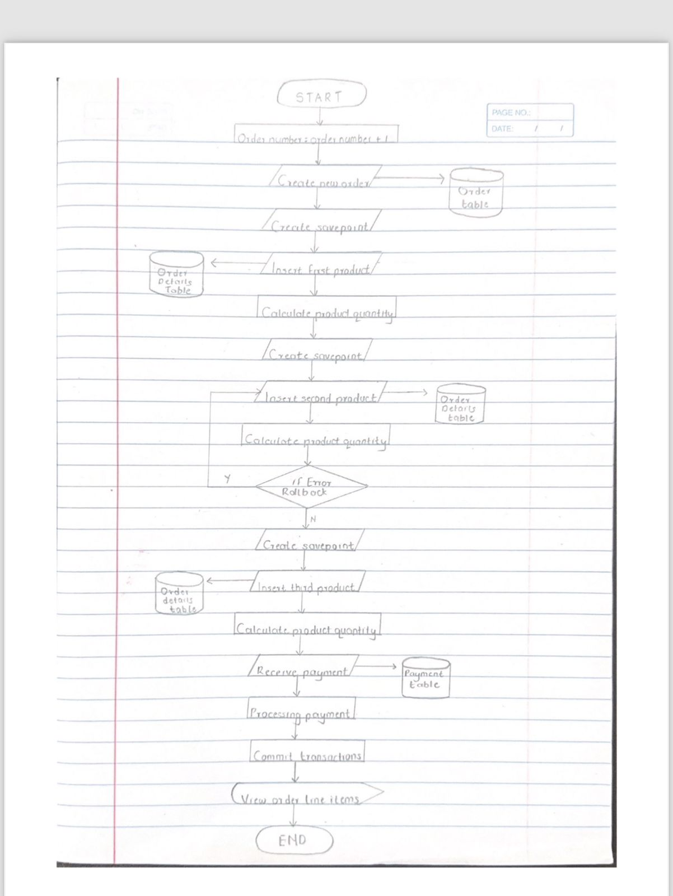
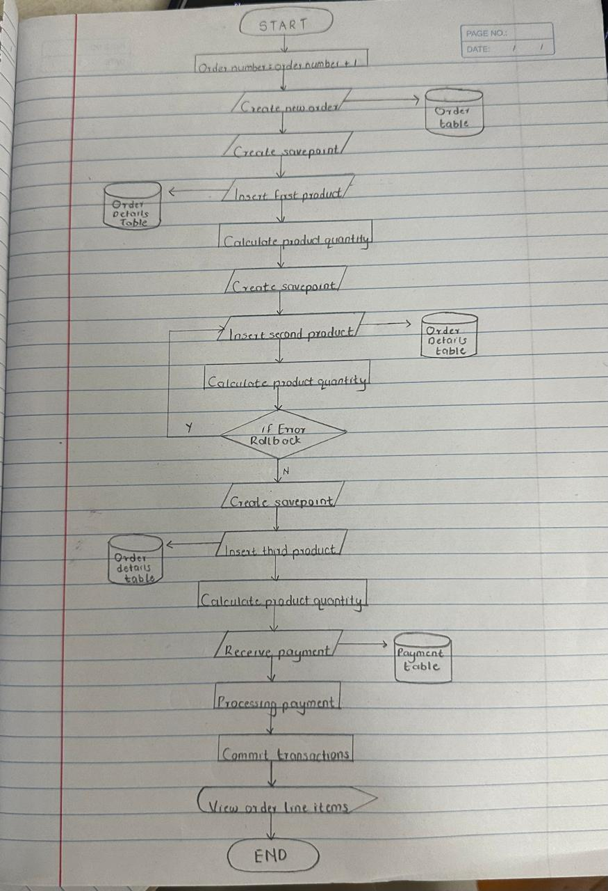

[](https://classroom.github.com/a/r-tQZu0l)
# BBT3104-Lab1of6-DatabaseTransactions


| **Key**                                                               | Value                                                                                                                                                                              |
|---------------|---------------------------------------------------------|
| **A6**                                                               | ? |
| **Semester Duration**                                                 | 19<sup>th</sup> August - 25<sup>th</sup> November 2024                                                                                                                       |

## Flowchart


## Pseudocode
```
1.Start the transaction.
2.Set order number by checking the largest order number from the table orders and add 1
3.Create new order for customer 145 with order number set in step 2 and set the status to "In Process".
 Set the order date as today's date(17/09/2024),set the required shipping date to 3 days from today(20/09/2024) and set the actual shipping date to 2 days from today(19/09/2024).
4.Create pause_point and name it before_product_1
5.Add the first product to order with a quantity of 2724 units and reduce 2724 units from the inventory of the product.
6.Create pause_point and name it before_product_2
7.Add the second product to order with a quantity of 540 units and reduce 540 units from the inventory of the product.
8.To fix any mistakes made with the second product, we can go back to our before_product_2 pause point to  undo only the second product addition but leave everything else intact.
9.Create pause_point and name it before_product_3
10.Add the third product to order with a quantity of 68 units and reduce 68 units from the inventory of the product.
11.Record the payment $300,000 made by customer 145.
12.Confirm everything and officially save all the changes.
13.Review the order details to make sure everything was added correctly.
14.End the transaction.
```
## Support for the Sales Departments' Report
At the point of receiving payment the database design can include a decision tree to check whether the balance has been paid fully or if there is a balance. In the case of a balance we can display the balance with details of the deadline of the payment.
